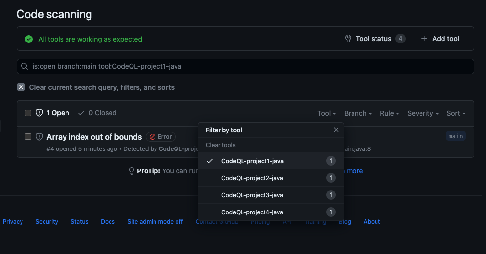

# Monorepo workflow for GitHub Advanced Security Code Scanning

> ℹ️ This is an _unofficial_ project created by Field Security Services, and is not officially supported by GitHub.

This sample GitHub Actions workflow shows you how to enable filtering results from different GitHub Advanced Security Code Scanning runs in the GitHub UI using a workaround.

This is useful when dealing with monorepos that have code for several different projects in the same repository.

You can use this workflow modification to mark each project with a unique scanning tool name, and then filter the results in the GitHub Security tab by that tool to only show results for a specific project.

The SARIF (the format for the code scanning results) is edited before upload to Code Scanning, changing the tool name. CodeQL is also set up so that the content of the SARIF populates the Code Scanning UI correctly.

The unique tool name can then be used to filter results in the web user interface:



> ℹ️ This is an _unofficial_ project created by Field Security Services, and is not officially supported by GitHub.

## Usage

To use this workaround, you need to make some modifications to your Actions workflow file that runs CodeQL.

This example uses a monorepo with Java code, but you can adapt it to your own monorepo.

### The changes in isolation

Change the typical `analyze` step from:

```yaml
    - name: Perform CodeQL Analysis
      uses: github/codeql-action/analyze@v2
      with:
        category: "/language:${{matrix.language}}"
```

to:

```yaml
    - name: Perform CodeQL Analysis
      uses: github/codeql-action/analyze@v2
      with:
        category: "/language:${{matrix.language}}"
        upload: False
        output: sarif-results
      env:
      # https://codeql.github.com/docs/codeql-cli/manual/database-analyze/#options
      # add code snippet, query help and group rules by pack, to the SARIF file
        CODEQL_ACTION_EXTRA_OPTIONS: '{"database":{"analyze":["--sarif-add-snippets","--sarif-add-query-help","--sarif-group-rules-by-pack"]}}'

    # Rename CodeQL tool to allow filtering by workflow in Code Scanning
    - name: Rename CodeQL tool
      run: |
        jq ".runs[0].tool.driver.name = \"CodeQL-${WORKFLOW_TAG}-${{matrix.language}}\"" sarif-results/${{ matrix.language }}.sarif > sarif-results/${{ matrix.language }}-edited.sarif
      env:
        # edit this tag to something unique to your workflow
        WORKFLOW_TAG: "some-unique-tag"  # this will name the tool 'CodeQL-some-unique-tag-java'

    # Upload the CodeQL Analysis results
    - name: Upload SARIF
      uses: github/codeql-action/upload-sarif@v2
      with:
        sarif_file: sarif-results/${{ matrix.language }}-edited.sarif
```

This will rename the CodeQL tool in the SARIF file to include the workflow tag, and uploads the SARIF file to Code Scanning.

The `analyze` step has some changes to ensure that the CodeQL results are displayed properly in the GitHub Advcanced Security UI.

### Full example workflow file

See [`codeql_sample_workflow.yml`](codeql_sample_workflow.yml).

This repo also contains a very basic monorepo to show it in action on a "real" repo.

## Requirements

* GitHub Actions with `jq` on the runner (included by default on the standard GitHub hosted runners)
* GitHub Advanced Security for private GitHub Enterprise repositories, or a public repository
* GitHub.com or GitHub Enterprise Server

## License

This project is licensed under the terms of the MIT open source license. Please refer to the [LICENSE](LICENSE) for the full terms.

## Maintainers

See [CODEOWNERS](CODEOWNERS) for the list of maintainers.

## Support

See the [SUPPORT](SUPPORT.md) file.

## Background

See the [CHANGELOG](CHANGELOG.md), [CONTRIBUTING](CONTRIBUTING.md), [SECURITY](SECURITY.md), [SUPPORT](SUPPORT.md), [CODE OF CONDUCT](CODE_OF_CONDUCT.md) and [PRIVACY](PRIVACY.md) files for more information.
